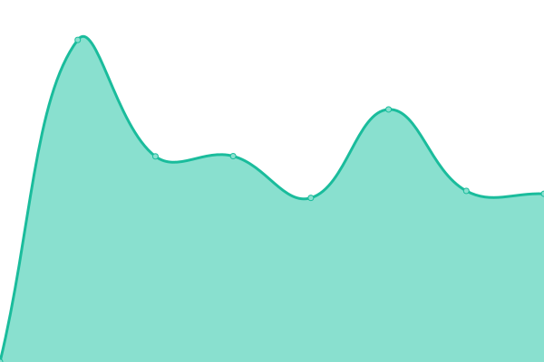

# [📈 Live Status](https://JEngrob.github.io/Randers-uptime): <!--live status--> **Alle systemer kører normalt**

This repository contains the open-source uptime monitor and status page for [JEngrob](https://JEngrob.github.io/Randers-uptime), powered by [Upptime](https://github.com/upptime/upptime).

With [Upptime](https://upptime.js.org), you can get your own unlimited and free uptime monitor and status page, powered entirely by a GitHub repository. We use [Issues](https://github.com/JEngrob/Randers-uptime/issues) as incident reports, [Actions](https://github.com/JEngrob/Randers-uptime/actions) as uptime monitors, and [Pages](https://JEngrob.github.io/Randers-uptime) for the status page.

<!--start: status pages-->
<!-- This summary is generated by Upptime (https://github.com/upptime/upptime) -->
<!-- Do not edit this manually, your changes will be overwritten -->
<!-- prettier-ignore -->
| URL | Status | History | Responstid | Uptime |
| --- | ------ | ------- | ------------- | ------ |
|  [Randers.dk](https://www.randers.dk) | Oppe | [randers-dk.yml](https://github.com/JEngrob/Randers-uptime/commits/HEAD/history/randers-dk.yml) | 

 1719ms
     
 | 

<a href="https://JEngrob.github.io/Randers-uptime/history/randers-dk">99.65%</a>
    

|  [Skolernes Udviklingscenter](https://skolernesudviklingscenter.randers.dk/da/soeg) | Oppe | [skolernesudviklingscenter-randers-dk.yml](https://github.com/JEngrob/Randers-uptime/commits/HEAD/history/skolernesudviklingscenter-randers-dk.yml) | 

 1773ms
     
 | 

<a href="https://JEngrob.github.io/Randers-uptime/history/skolernesudviklingscenter-randers-dk">99.84%</a>
    

|  [Nordbyen Kalder](https://nordbyenkalder.randers.dk/soeg) | Oppe | [nordbyenkalder-randers-dk.yml](https://github.com/JEngrob/Randers-uptime/commits/HEAD/history/nordbyenkalder-randers-dk.yml) | 

 1618ms
     
 | 

<a href="https://JEngrob.github.io/Randers-uptime/history/nordbyenkalder-randers-dk">99.84%</a>
    

|  [Sprogcenter Randers](https://sprogcenter.randers.dk/soeg) | Oppe | [sprogcenter-randers-dk.yml](https://github.com/JEngrob/Randers-uptime/commits/HEAD/history/sprogcenter-randers-dk.yml) | 

 1797ms
     
 | 

<a href="https://JEngrob.github.io/Randers-uptime/history/sprogcenter-randers-dk">99.84%</a>
    

|  [Børnehuset Mælkevejen](https://www.museumoj.dk) | Oppe | [museumoj.dk.yml](https://github.com/JEngrob/Randers-uptime/commits/HEAD/history/museumoj.dk.yml) | 

 1446ms
     
 | 

<a href="https://JEngrob.github.io/Randers-uptime/history/museumoj.dk">99.84%</a>
    

<!--end: status pages-->

[**Visit our status website →**](https://JEngrob.github.io/Randers-uptime)

## 📄 License

- Powered by: [Upptime](https://github.com/upptime/upptime)
- Code: [MIT](./LICENSE) © [Anand Chowdhary](https://anandchowdhary.com), supported by [Pabio](https://pabio.com)
- Data in the `./history` directory: [Open Database License](https://opendatacommons.org/licenses/odbl/1-0/)
